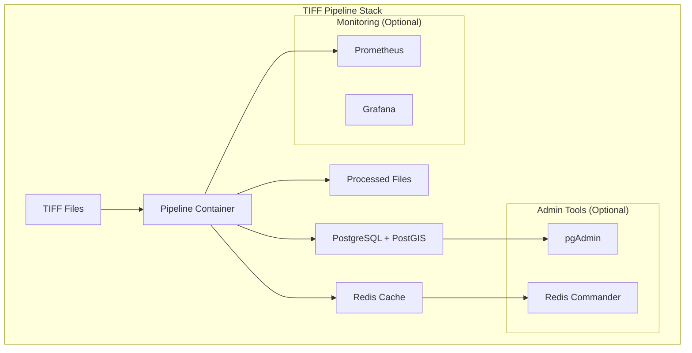

# TIFF Enrichment Pipeline - Docker Deployment

A comprehensive Docker-based deployment setup for the TIFF enrichment pipeline with PostGIS database, Redis caching, monitoring, and administration tools.

## 🚀 Quick Start

### Option 1: Using Published Images (Recommended)

```bash
# 1. Clone the repository
git clone https://github.com/casper-aurai/tiff-enrichment-pipeline.git
cd tiff-enrichment-pipeline

# 2. Initialize the project
make init

# 3. Edit your environment configuration  
vim .env

# 4. Start with published images (no build required)
make up-published

# 5. Check status
make status
```

### Option 2: Building from Source

```bash
# 1. Initialize the project
make init

# 2. Edit your environment configuration
vim .env

# 3. Build and start the pipeline
make build
make up

# 4. Check status
make status
```

## 📦 **Container Images**

Pre-built multi-architecture images are available:

- **GitHub Container Registry**: `ghcr.io/casper-aurai/tiff-enrichment-pipeline:latest`
- **Docker Hub**: `casper-aurai/tiff-enrichment-pipeline:latest`

### **Available Tags**

| Tag | Description | Use Case |
|-----|-------------|----------|
| `latest` | Latest stable release | Production |
| `develop` | Development build | Testing |
| `v1.2.3` | Specific version | Production (pinned) |

### **Supported Architectures**

- ✅ `linux/amd64` (Intel/AMD 64-bit)
- ✅ `linux/arm64` (Apple Silicon, ARM servers)

### **Using Published Images**

```bash
# Pull latest images
make pull

# Start with published images
make up-published

# Start with admin tools
make up-published-full

# Start everything (admin + monitoring)
make up-published-all
```

For detailed container publishing information, see [CONTAINER_PUBLISHING.md](CONTAINER_PUBLISHING.md).

## 📋 Prerequisites

- Docker (20.10+)
- Docker Compose (2.0+)
- Make (for convenience commands)
- At least 4GB RAM for full stack
- 10GB disk space for data and containers

## 🏗️ Architecture



## 🐳 Services Overview

| Service | Purpose | Default Port | Profile |
|---------|---------|--------------|---------|
| `tiff-pipeline` | Main application | - | default |
| `postgres` | Database with PostGIS | 5432 | default |
| `redis` | API response caching | 6379 | default |
| `pgadmin` | Database administration | 8080 | admin |
| `redis-commander` | Cache management | 8081 | admin |
| `prometheus` | Metrics collection | 9090 | monitoring |
| `grafana` | Monitoring dashboards | 3000 | monitoring |
| `file-watcher` | Automatic file processing | - | watcher |

## ⚙️ Configuration

### Environment Variables

Copy `.env.template` to `.env` and configure:

```bash
# Database
POSTGRES_PASSWORD=your_secure_password

# API Keys
USGS_API_KEY=your_usgs_key
OPENMETEO_API_KEY=your_weather_key

# Notifications
SLACK_WEBHOOK_URL=https://hooks.slack.com/...

# Processing
MAX_WORKERS=4
PROCESSING_BATCH_SIZE=5
```

### Directory Structure

```
tiff-pipeline/
├── data/
│   ├── input/          # Place TIFF files here
│   ├── output/         # Processed files output
│   └── failed/         # Failed processing files
├── logs/               # Application logs
├── config/             # Configuration files
├── monitoring/         # Prometheus/Grafana config
└── scripts/            # Database and utility scripts
```

## 🚀 Deployment Options

### Development Setup

```bash
# Basic pipeline only
make up                    # Build from source
make up-published         # Use published images

# With admin tools
make up-full              # Build from source
make up-published-full    # Use published images

# With monitoring
make up-monitoring
make up-published-monitoring

# Everything (admin + monitoring + file watcher)
make up-all
make up-published-all
```

### Production Deployment

```bash
# Deploy with production overrides
make deploy-prod

# Or manually with compose files
docker-compose -f docker-compose.yml -f docker-compose.prod.yml up -d
```

## 📊 Monitoring & Administration

### Access Web Interfaces

- **pgAdmin**: http://localhost:8080 (admin profile)
- **Redis Commander**: http://localhost:8081 (admin profile)
- **Grafana**: http://localhost:3000 (monitoring profile)
- **Prometheus**: http://localhost:9090 (monitoring profile)

### Default Credentials

Check your `.env` file for:
- pgAdmin: `PGADMIN_EMAIL` / `PGADMIN_PASSWORD`
- Grafana: `admin` / `GRAFANA_PASSWORD`

## 🔧 Common Commands

### Container Management

```bash
# Published images
make pull                 # Pull latest images
make up-published        # Start with published images
make up-published-full   # Start with admin tools

# Local build
make build               # Build images from source
make up                  # Start with local build
make up-full            # Start with admin tools
```

### File Operations

```bash
# Process files in input directory
make process-sample

# Start automatic file watcher
make watch-start

# Stop file watcher
make watch-stop
```

### Database Operations

```bash
# Connect to database shell
make db-shell

# Create backup
make db-backup

# Restore from backup
make db-restore BACKUP_FILE=backups/backup.sql

# Reset database (⚠️ destructive)
make db-reset
```

### Development

```bash
# Run tests
make test

# Format code
make format

# Check code quality
make lint

# Open shell in container
make shell
```

### Monitoring

```bash
# View all logs
make logs

# View pipeline logs only
make logs-pipeline

# Check service health
make health
```

## 🐛 Troubleshooting

### Common Issues

#### Services won't start
```bash
# Check Docker daemon
docker info

# Check port conflicts
netstat -tulpn | grep :5432

# Check logs
make logs
```

#### Database connection issues
```bash
# Verify database is running
make db-shell

# Check credentials in .env
grep POSTGRES .env

# Reset database
make db-reset
```

#### Out of disk space
```bash
# Clean up containers and volumes
make clean

# Remove unused Docker resources
docker system prune -a

# Check disk usage
df -h
docker system df
```

#### API quota exceeded
```bash
# Check API usage in logs
make logs-pipeline | grep "API"

# View API usage in database
make db-shell
SELECT * FROM monitoring.api_usage ORDER BY request_timestamp DESC LIMIT 10;
```

### Performance Tuning

#### Adjust worker processes
```bash
# In .env file
MAX_WORKERS=8
PROCESSING_BATCH_SIZE=10
```

#### Database optimization
```bash
# Production postgres settings are in docker-compose.prod.yml
# Adjust based on available RAM:
# - shared_buffers: 25% of RAM
# - effective_cache_size: 75% of RAM
```

#### Redis memory
```bash
# In docker-compose.yml, adjust maxmemory
command: redis-server --maxmemory 1gb
```

## 📈 Scaling

### Horizontal Scaling

```bash
# Scale pipeline workers
docker-compose up -d --scale tiff-pipeline=3

# Use external database
# Set DATABASE_URL to external PostgreSQL instance
```

### Resource Limits

Production deployment includes resource limits:
- Pipeline: 4 CPU, 8GB RAM
- Database: 2 CPU, 4GB RAM
- Redis: 1 CPU, 1GB RAM

## 🔒 Security

### Production Considerations

1. **Change default passwords** in `.env`
2. **Use SSL certificates** (configure nginx)
3. **Restrict network access** to admin interfaces
4. **Regular backups** with `make db-backup`
5. **Monitor logs** for suspicious activity
6. **Keep images updated** with `make pull && make restart`

### Network Security

```bash
# Production uses custom network subnet
# Configure firewall to restrict access:
# - 5432 (PostgreSQL): internal only
# - 6379 (Redis): internal only
# - 8080+ (Admin tools): VPN/internal only
```

## 📄 File Processing Workflow

1. **Place TIFF files** in `data/input/`
2. **Automatic validation** checks file integrity and metadata
3. **Geospatial enrichment** fetches elevation, weather, land cover data
4. **Raster processing** applies enhancements using GDAL
5. **Output storage** in `data/output/` with JSON metadata
6. **Database tracking** logs all processing steps

## 🧪 Testing

### Sample Data

```bash
# Create test TIFF files
docker-compose exec tiff-pipeline python /app/scripts/create_sample_tiffs.py

# Process test files
make process-sample
```

### Validation

```bash
# Run test suite
make test

# Check output structure
ls -la data/output/

# Verify database entries
make db-shell
SELECT COUNT(*) FROM pipeline.processing_runs;
```

## 📚 Additional Resources

- [Container Publishing Guide](CONTAINER_PUBLISHING.md) - Detailed container registry setup
- [Quick Start Guide](QUICKSTART.md) - 5-minute setup guide
- [GDAL Documentation](https://gdal.org/programs/index.html)
- [PostGIS Manual](https://postgis.net/documentation/)
- [Docker Compose Reference](https://docs.docker.com/compose/)
- [Prometheus Configuration](https://prometheus.io/docs/prometheus/latest/configuration/configuration/)

## 🤝 Support

For issues or questions:

1. Check logs: `make logs`
2. Verify configuration: `make health`
3. Review troubleshooting section above
4. Create an issue with:
   - Environment details
   - Error messages
   - Steps to reproduce

---

**Note**: This deployment setup is designed for both development and production use. For production, ensure you review and customize the security, backup, and monitoring configurations for your specific environment.