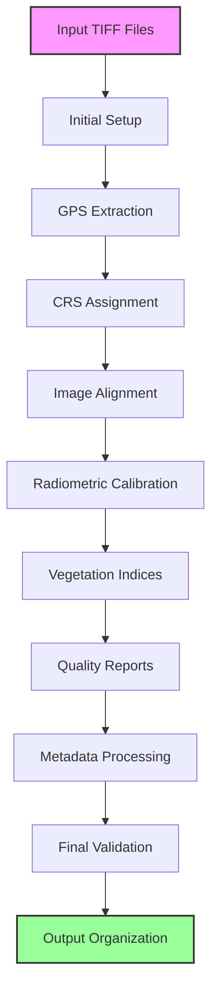

# TIFF Enrichment Pipeline Steps

## Pipeline Overview
The TIFF Enrichment Pipeline is a comprehensive processing system designed for multispectral TIFF files, with specialized support for MicaSense RedEdge-M data. The pipeline implements a robust sequence of steps to ensure accurate processing, validation, and quality control of multispectral imagery.

## Pipeline Workflow


## Design Decisions
### Why This Architecture?
- **Modular Design**: Each processing step is isolated to allow for independent testing and maintenance
- **Pipeline Approach**: Sequential processing ensures data consistency and traceability
- **WGS84 CRS**: Standard coordinate system for global compatibility
- **Python-based**: Leverages scientific computing ecosystem (NumPy, GDAL, Rasterio)
- **File-based Processing**: Enables distributed processing and checkpoint recovery

### Trade-offs
- Processing speed vs. memory usage
- Accuracy vs. processing time
- Storage space vs. data quality
- Automation vs. manual intervention

## Getting Started Guide
### Quick Start
1. Clone the repository
2. Install dependencies: `pip install -r requirements.txt`
3. Configure settings in `config.yaml`
4. Run the pipeline: `python main.py --input /path/to/tiffs`

### Sample Data
- Example TIFF files available in `/examples/data`
- Sample configuration in `/examples/config`
- Test scripts in `/examples/tests`

### Common Pitfalls
- Ensure sufficient disk space (100GB+ recommended)
- Check file permissions on output directories
- Verify GPS data presence in input files
- Monitor system memory during processing

## Troubleshooting
### Common Issues
1. **Memory Errors**
   - Solution: Increase swap space or reduce batch size
   - Check: `free -h` for available memory

2. **GPS Data Missing**
   - Solution: Verify EXIF data in source files
   - Check: `exiftool` output for GPS tags

3. **Alignment Failures**
   - Solution: Check image quality and overlap
   - Check: Alignment quality metrics in logs

4. **Calibration Errors**
   - Solution: Verify calibration coefficients
   - Check: Calibration report in quality_reports

### Debugging Tips
- Enable verbose logging: `--log-level DEBUG`
- Check processing logs in `/logs`
- Use `--dry-run` for validation without processing
- Monitor system resources during execution

## Contributing Guidelines
### How to Contribute
1. Fork the repository
2. Create a feature branch
3. Make your changes
4. Run tests: `pytest tests/`
5. Submit a pull request

### Code Style
- Follow PEP 8 guidelines
- Use type hints
- Document all functions
- Write unit tests for new features

### Pull Request Process
1. Update documentation
2. Add tests
3. Ensure CI passes
4. Get code review
5. Address feedback

## Performance Benchmarks
### Processing Times
- Small dataset (10 images): ~5 minutes
- Medium dataset (100 images): ~45 minutes
- Large dataset (1000 images): ~8 hours

### Resource Usage
- CPU: 4-8 cores recommended
- RAM: 16GB minimum, 32GB recommended
- Storage: 100GB+ for processing
- GPU: Optional for acceleration

### Optimization Tips
- Use SSD for faster I/O
- Enable multi-threading
- Batch process similar images
- Use GPU acceleration when available

## Security Considerations
### Data Handling
- Input validation for all file operations
- Secure file permissions
- No sensitive data in logs
- Regular security audits

### Access Control
- Role-based access control
- API key authentication
- Secure configuration storage
- Audit logging

## Version History
### v1.0.0 (2024-03-15)
- Initial release
- Basic pipeline functionality
- Core processing steps

### v1.1.0 (2024-03-20)
- Added GPU acceleration
- Improved error handling
- Enhanced logging

### v1.2.0 (2024-03-25)
- New vegetation indices
- Performance optimizations
- Bug fixes

## Testing Strategy
### Unit Tests
- Run: `pytest tests/unit/`
- Coverage target: 80%
- CI integration

### Integration Tests
- Run: `pytest tests/integration/`
- End-to-end validation
- Performance benchmarks

### Test Data
- Sample datasets in `/tests/data`
- Mock configurations
- Expected outputs

## Deployment Guide
### Production Setup
1. Install dependencies
2. Configure environment
3. Set up monitoring
4. Deploy services

### Environment Configuration
- Required environment variables
- Configuration files
- System requirements

### Scaling Considerations
- Horizontal scaling
- Load balancing
- Resource monitoring
- Backup strategies

## API Documentation
### Input Parameters
```python
{
    "input_dir": "path/to/tiffs",
    "output_dir": "path/to/output",
    "config_file": "path/to/config.yaml",
    "log_level": "INFO"
}
```

### Output Format
```python
{
    "status": "success",
    "processing_time": "00:45:30",
    "output_files": [...],
    "quality_metrics": {...}
}
```

### Rate Limits
- Maximum concurrent jobs: 4
- File size limit: 2GB
- Processing timeout: 24 hours

## System Requirements
- Python 3.8 or higher
- GDAL 3.4.0 or higher
- Rasterio 1.3.0 or higher
- NumPy 1.21.0 or higher
- OpenCV 4.5.0 or higher
- Minimum 16GB RAM recommended
- 100GB+ free disk space for processing large datasets

## Input Requirements
- Supported file formats: TIFF, GeoTIFF
- Required bands for MicaSense RedEdge-M:
  - Blue (Band 1): 475nm
  - Green (Band 2): 560nm
  - Red (Band 3): 668nm
  - NIR (Band 4): 840nm
  - Red Edge (Band 5): 717nm
- Minimum image dimensions: 1280x960 pixels
- Required metadata: GPS coordinates, altitude, timestamp

## Processing Steps Order

1. **Initial Setup**
   - Create output directories with proper permissions
   - Initialize logging with rotation and backup
   - Load configuration from YAML/JSON
   - Validate system resources
   - Check required dependencies
   - Initialize error tracking system

2. **Input File Processing**
   - Scan input directory for TIFF files
   - Group files into image sets (for MicaSense)
   - Basic file existence and format checks
   - Validate file integrity
   - Check for corrupt or incomplete files
   - Generate file inventory report
   - Create backup of original files

3. **GPS Information Extraction**
   - Extract GPS coordinates from reference band
   - Extract altitude information
   - Extract timestamp information
   - Validate coordinate system
   - Check for GPS signal quality
   - Generate GPS track visualization
   - Export GPS data to GeoJSON format

   ### GPS Calculation Example
   ```python
   # Example GPS coordinate extraction
   def extract_gps_coordinates(image):
       exif = image.getexif()
       gps_info = exif.get(34853)  # GPS IFD tag
       lat = convert_to_degrees(gps_info[2])
       lon = convert_to_degrees(gps_info[4])
       alt = gps_info[6]
       return lat, lon, alt
   ```

4. **CRS and Transform Assignment**
   - Calculate ground sample distance (GSD)
   - Calculate pixel size in degrees
   - Assign WGS84 (EPSG:4326) CRS
   - Create proper transform matrix
   - Validate coordinate transformations
   - Generate CRS validation report
   - Export transformation parameters

   ### GSD Calculation Example
   ```python
   # Ground Sample Distance calculation
   def calculate_gsd(altitude, focal_length, sensor_width, image_width):
       gsd = (altitude * sensor_width) / (focal_length * image_width)
       return gsd  # in meters per pixel
   ```

5. **Image Alignment**
   - Use reference band (Band 3) as base
   - Align all bands to reference
   - Preserve CRS and transform
   - Apply sub-pixel alignment
   - Generate alignment quality metrics
   - Create alignment visualization
   - Output: `/data/output/micasense/aligned/`

   ### Alignment Process
   ```mermaid
   graph LR
       A[Reference Band] --> B[Feature Detection]
       C[Target Band] --> D[Feature Detection]
       B --> E[Feature Matching]
       D --> E
       E --> F[Transform Estimation]
       F --> G[Image Warping]
       G --> H[Aligned Image]
   ```

6. **Radiometric Calibration**
   - Apply calibration coefficients
   - Scale to reflectance values
   - Preserve CRS and transform
   - Apply atmospheric correction
   - Generate calibration report
   - Output: `/data/output/micasense/calibrated/`

   ### Calibration Formula
   ```python
   # Radiometric calibration
   def calibrate_image(raw_dn, dark_current, vignette, calibration_coef):
       # Remove dark current
       corrected = raw_dn - dark_current
       # Apply vignette correction
       corrected = corrected / vignette
       # Apply calibration coefficient
       reflectance = corrected * calibration_coef
       return reflectance
   ```

7. **Vegetation Indices Calculation**
   - Calculate NDVI, NDRE, GNDVI, etc.
   - Preserve CRS and transform
   - Generate index statistics
   - Create index visualizations
   - Output: `/data/output/micasense/indices/`

   ### Index Calculations
   ```python
   # Vegetation indices calculations
   def calculate_ndvi(nir, red):
       return (nir - red) / (nir + red)

   def calculate_ndre(nir, red_edge):
       return (nir - red_edge) / (nir + red_edge)

   def calculate_gndvi(nir, green):
       return (nir - green) / (nir + green)
   ```

   ### Index Visualization
   ```mermaid
   graph TD
       A[Multispectral Bands] --> B[NDVI]
       A --> C[NDRE]
       A --> D[GNDVI]
       B --> E[Index Statistics]
       C --> E
       D --> E
       E --> F[Visualization]
   ```

8. **Quality Report Generation**
   - Generate histograms
   - Calculate statistics
   - Create quality metrics
   - Generate PDF reports
   - Output: `/data/output/micasense/quality_reports/`

   ### Quality Metrics
   ```python
   # Quality metrics calculation
   def calculate_quality_metrics(image):
       metrics = {
           'mean': np.mean(image),
           'std': np.std(image),
           'min': np.min(image),
           'max': np.max(image),
           'snr': calculate_snr(image),
           'sharpness': calculate_sharpness(image)
       }
       return metrics
   ```

9. **Metadata Processing**
   - Extract and validate metadata
   - Save processing information
   - Generate metadata reports
   - Output: `/data/output/micasense/metadata/`

   ### Metadata Structure
   ```mermaid
   graph TD
       A[Image Metadata] --> B[Acquisition Info]
       A --> C[Processing Info]
       A --> D[Quality Info]
       B --> E[GPS Data]
       B --> F[Timestamp]
       C --> G[Calibration]
       C --> H[Alignment]
       D --> I[Statistics]
       D --> J[Validation]
   ```

10. **Final Validation**
    - Validate transformed and calibrated images
    - Check CRS and transform
    - Verify data ranges and statistics
    - Generate validation report
    - Perform consistency checks
    - Validate output formats
    - Generate processing summary

    ### Validation Process
    ```mermaid
    graph TD
        A[Input Validation] --> B[Process Validation]
        B --> C[Output Validation]
        C --> D[Quality Check]
        D --> E[Final Report]
        
        style A fill:#f96,stroke:#333,stroke-width:2px
        style E fill:#9f9,stroke:#333,stroke-width:2px
    ```

11. **Output Organization**
    - Save all processed files
    - Generate processing summary
    - Create visualization thumbnails
    - Output: Various subdirectories in `/data/output/micasense/`

    ### Output Structure
    ```mermaid
    graph TD
        A[Processed Data] --> B[Aligned Images]
        A --> C[Calibrated Images]
        A --> D[Vegetation Indices]
        A --> E[Quality Reports]
        A --> F[Metadata]
        
        style A fill:#f9f,stroke:#333,stroke-width:2px
    ```

## Output Directory Structure
```
/data/output/micasense/
├── aligned/          # Aligned multispectral images
│   ├── band1/       # Blue band aligned images
│   ├── band2/       # Green band aligned images
│   ├── band3/       # Red band aligned images
│   ├── band4/       # NIR band aligned images
│   └── band5/       # Red Edge band aligned images
├── calibrated/       # Radiometrically calibrated images
│   ├── reflectance/ # Reflectance values
│   └── radiance/    # Radiance values
├── indices/          # Vegetation indices
│   ├── ndvi/        # NDVI calculations
│   ├── ndre/        # NDRE calculations
│   └── custom/      # Custom indices
├── individual_bands/ # Individual band processing outputs
│   ├── raw/         # Raw band data
│   └── processed/   # Processed band data
├── metadata/         # Processing metadata
│   ├── gps/         # GPS information
│   ├── sensor/      # Sensor parameters
│   └── processing/  # Processing history
├── quality_reports/  # Quality control reports
│   ├── histograms/  # Band histograms
│   ├── statistics/  # Statistical analysis
│   └── validation/  # Validation reports
├── thumbnails/       # Image thumbnails
│   ├── rgb/         # RGB composites
│   └── indices/     # Index visualizations
└── visualizations/   # Visualization outputs
    ├── maps/        # Geospatial visualizations
    └── charts/      # Statistical charts
```

### Directory Descriptions

#### aligned/
- Contains all aligned multispectral bands
- Each band is stored in its respective subdirectory
- Files are named with pattern: `{date}_{time}_band{number}_aligned.tif`

#### calibrated/
- Stores radiometrically calibrated images
- Separate directories for reflectance and radiance values
- Files are named with pattern: `{date}_{time}_band{number}_calibrated.tif`

#### indices/
- Contains calculated vegetation indices
- Each index type has its own subdirectory
- Files are named with pattern: `{date}_{time}_{index_name}.tif`

#### individual_bands/
- Stores individual band processing outputs
- Raw and processed versions of each band
- Useful for debugging and quality control

#### metadata/
- Contains all processing metadata
- GPS information, sensor parameters, and processing history
- Stored in JSON format for easy parsing

#### quality_reports/
- Comprehensive quality control reports
- Includes histograms, statistics, and validation results
- Generated in both PDF and JSON formats

#### thumbnails/
- Quick preview images for all processed data
- RGB composites and index visualizations
- Useful for quick quality assessment

#### visualizations/
- Advanced visualization outputs
- Geospatial maps and statistical charts
- Generated in various formats (PNG, PDF, HTML)

### File Naming Conventions
- Date format: YYYYMMDD
- Time format: HHMMSS
- Band numbers: 1-5 (for MicaSense RedEdge-M)
- Processing step: aligned, calibrated, indices, etc.
- Example: `20240315_143022_band3_aligned.tif`

### File Formats
- Images: GeoTIFF (.tif)
- Metadata: JSON (.json)
- Reports: PDF (.pdf)
- Visualizations: PNG (.png), PDF (.pdf), HTML (.html)

## Validation Criteria
- CRS must be EPSG:4326 (WGS84)
- Transform must be properly set (non-identity)
- Image dimensions must meet minimum requirements
- Data ranges must be valid
- Zero ratio must be within acceptable limits
- Required metadata must be present
- Additional validation checks:
  - Band alignment accuracy
  - Radiometric calibration accuracy
  - GPS coordinate accuracy
  - File format compliance
  - Data integrity
  - Processing completeness

## Error Handling
- Each step includes error logging
- Failed processing attempts are recorded
- Validation failures are documented
- Processing summary includes success/failure counts
- Error recovery mechanisms:
  - Automatic retry for transient errors
  - Checkpoint recovery
  - Partial results preservation
  - Error notification system
  - Error categorization and reporting

## Performance Optimization
- Multi-threading support
- GPU acceleration where available
- Memory management optimization
- Disk I/O optimization
- Processing pipeline parallelization
- Cache management
- Resource monitoring

## Monitoring and Logging
- Detailed logging of each processing step
- Performance metrics tracking
- Resource usage monitoring
- Error tracking and reporting
- Processing time statistics
- Quality metrics logging
- System health monitoring

## Maintenance and Updates
- Regular dependency updates
- Performance optimization
- Bug fixes and improvements
- New feature integration
- Documentation updates
- Testing and validation
- Backup and recovery procedures

## Support and Documentation
- Detailed API documentation
- User guides and tutorials
- Troubleshooting guides
- FAQ section
- Contact information
- Issue tracking
- Feature requests

## 🛰️ Band Usage for Vegetation Indices

The pipeline expects MicaSense RedEdge-M band order:
- Band 1: Blue (475nm)
- Band 2: Green (560nm)
- Band 3: Red (668nm)
- Band 4: NIR (840nm)
- Band 5: Red Edge (717nm)

**Vegetation Indices Calculations:**
- NDVI: NIR (4), Red (3)
- NDRE: NIR (4), Red Edge (5)
- GNDVI: NIR (4), Green (2)
- SAVI: NIR (4), Red (3)
- MSAVI: NIR (4), Red (3)
- EVI: NIR (4), Red (3), Blue (1)
- OSAVI: NIR (4), Red (3)
- NDWI: Green (2), NIR (4)

All 5 bands are used in the pipeline's index calculations.

## 📊 Validation Report (Automated)

After each run, the pipeline generates a comprehensive validation report in `data/output/micasense/quality_reports/`:
- Basic statistics (min, max, mean, median, std, percentiles)
- Histogram images and bin counts
- Key value range percentages (e.g., NDVI classes)
- NoData/invalid pixel counts
- Outlier detection
- Spatial consistency checks (CRS, transform, shape)
- Thumbnails for each index
- Summary CSV/JSON tables
- (If applicable) Temporal and reference checks

See `validation_report.json` and `validation_report.csv` for details. 